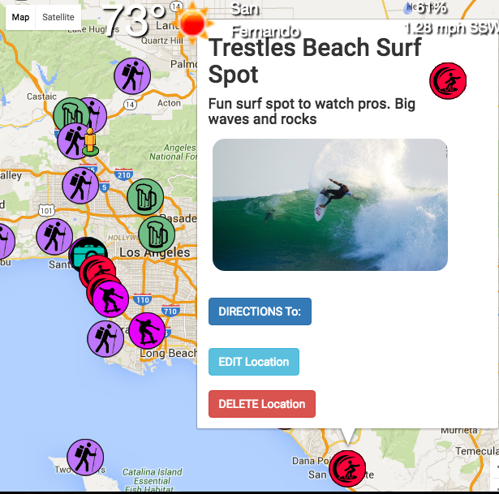

"Out and About" adds activity locations to a Google Map.
Info, Picture, weather conditions, surf report, snow report, driving directions is displayed,
allowing the user to see at a glance which activities are worth doing.

Trello: https://trello.com/b/wVMsTWCf/out-and-about

Technologies:

    - Mongo
    - Node
    - Express
    - AngularJS
    - Bootstrap
    - Angular-Route
    - Angularjs-Geolocation
